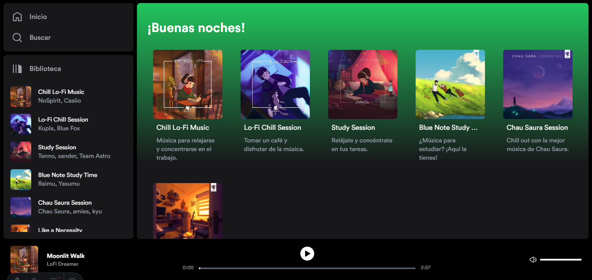
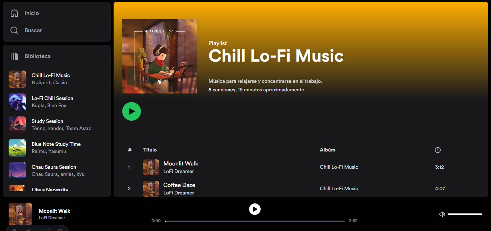

# Spotify Clone

This is a clone of the Spotify web app using Astro. This project is for educational purposes only.

## 🚀 Quick start

1.  **Clone the repository.**

```sh
git clone https://github.com/Gustavoand39/spotify-clone.git
```

2.  **Install dependencies.**

```sh
npm install
```

3.  **Start the development server.**

```sh
npm run dev
```

4.  **Open the source code and start editing!**

Your site is now running at `http://localhost:4321`!

## 🖼️ Preview





## 🧞 Commands

All commands are run from the root of the project, from a terminal:

| Command                   | Action                                           |
| :------------------------ | :----------------------------------------------- |
| `npm install`             | Installs dependencies                            |
| `npm run dev`             | Starts local dev server at `localhost:4321`      |
| `npm run build`           | Build your production site to `./dist/`          |
| `npm run preview`         | Preview your build locally, before deploying     |
| `npm run astro ...`       | Run CLI commands like `astro add`, `astro check` |
| `npm run astro -- --help` | Get help using the Astro CLI                     |

## 👀 Want to learn more?

Feel free to check [our documentation](https://docs.astro.build) or jump into our [Discord server](https://astro.build/chat).
